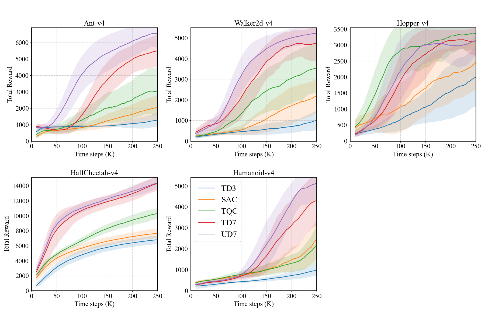
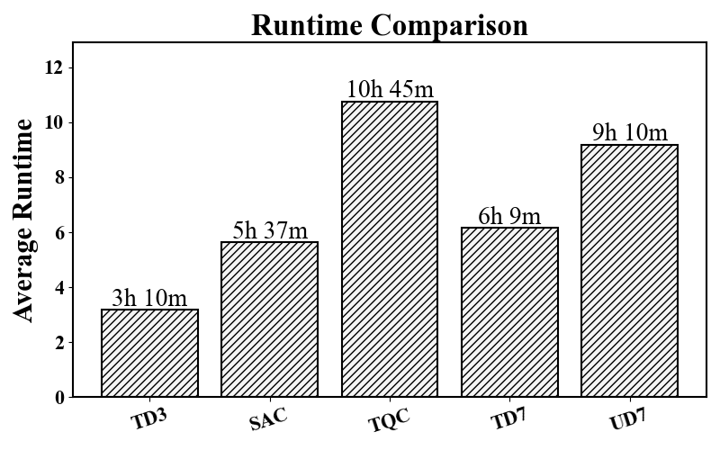

<div align="center">
  <h1>UD7</h1>
  <h3>Provable Generalization of Clipped Double Q-Learning for Variance Reduction and Sample Efficiency</h3>
  
  <a href="https://www.python.org/">
    
  </a>
  &nbsp;&nbsp;
  <a href="https://pytorch.org/">
    
  </a>
  &nbsp;&nbsp;
  <a href="https://www.sciencedirect.com/journal/neurocomputing">
    
  </a>
  &nbsp;&nbsp;
  <a href="https://www.elsevier.com/">
    
  </a>
</div>

---

## PyTorch Implementation

This repository contains a PyTorch implementation of **UD7** of the paper:

> **Provable Generalization of Clipped Double Q-Learning for Variance Reduction and Sample Efficiency**  
> Jangwon Kim, Jiseok Jeong, Soohee Han  
> *Neurocomputing*, Volume 673, 7 April 2026, 132772

### Paper Link
https://www.sciencedirect.com/science/article/abs/pii/S0925231226001694

---

**UD7** is an off-policy actor–critic algorithm that builds on a TD7-style training pipeline, while replacing the critic target **formulation** with **UBOC**.

---

## 1) Background: Clipped Double Q-Learning (CDQ)

Clipped double Q-learning is a widely-used bias correction in actor-critic methods (e.g., TD3). It maintains **two critics** and uses the **minimum** of the two as the TD target:

$$
y_{\text{CDQ}}(s_t,a_t)=r_t+\gamma \min_{i\in\{1,2\}} \bar Q_i(s_{t+1}, a_{t+1})
$$

### Strengths (why CDQ is popular)
- **Effective overestimation control:** taking a minimum is conservative, often preventing exploding Q-values.
- **Robust baseline behavior:** works well across many continuous-control tasks.

### Limitations
- **High variance:** when critics are poorly learned early on, the min operator can yield high-variance TD targets, destabilizing TD learning and reducing sample efficiency.

**UBOC is motivated by a concrete question:**
> Can we obtain **the same expected target value as CDQ**, but with **smaller variance**?

---

## 2) UBOC: Uncertainty-Based Overestimation Correction

UBOC views the critic outputs as a **distribution of Q estimates** (because function approximation is noisy).  
Instead of using `min(Q1, Q2)`, UBOC uses **N critics** to estimate:
- a **mean** \(m\),
- an **(unbiased) standard deviation** \(\hat s\),
and then forms a corrected value:

$$
Q_{\text{corrected}} = m - x\cdot \hat s
$$

where \(x>0\) controls conservativeness.

### 2.1 Expectation equivalence to clipped double-Q

Under the assumption that critic estimates behave like i.i.d. samples from a normal distribution, we can derive:

$$
\mathbb{E}\left[\min(Q_A, Q_B)\right]=\mathbb{E}\left[m - \frac{\hat s}{\sqrt{\pi}}\right]
$$

This is the key insight:
- choosing $$x=1/\sqrt{\pi}$$ makes the corrected estimate **match CDQ in expectation**.

### 2.2 Variance reduction

We can further prove that the estimator

$$
m - \frac{\hat s}{\sqrt{\pi}}
$$

has **strictly smaller variance** than the CDQ minimum-based target, and the **variance gap is strictly positive for all $$N\ge 2\$$**.

As $$N\to\infty$$, the maximum achievable variance reduction is upper-bounded by:

$$
\sigma^2\left(1-\frac{1}{\pi}\right)
$$

**It means that**
- UBOC does not only “bias-correct”; it **reduces noise** in TD targets.
- This is especially important early in training, where noisy targets can derail learning.

### 2.3 UBOC TD target

Using N target critics $$Q_1,\dots, Q_N$$, compute:


**Mean**

$$
m(s,a) = \frac{1}{N}\sum_{i=1}^N  Q_i(s,a)
$$

**Unbiased variance (Approximation)**

$$
\hat v(s,a)=\frac{1}{N-1}\sum_{i=1}^N \left( Q_i(s,a)-m(s,a)\right)^2
$$

Then the **UBOC target** is:

$$
y_{\text{UBOC}}(s_t,a_t)=r_t + \gamma\left(m(s_{t+1},a_{t+1}) - \sqrt{\frac{\hat v(s_{t+1},a_{t+1})}{\pi}}\right)
$$

where $$a_{t+1}$$ can be computed with target policy smoothing.

This gives a *dynamic* bias correction driven by critic uncertainty.

---

## 3) UD7: TD7 + UBOC Targets

**UD7** integrates UBOC into a TD7-style pipeline and emphasizes strong sample efficiency.

- UD7 uses the TD7 background for practical stability/efficiency.
- **The main difference from TD7 is the critic training target:** UD7 uses **UBOC targets** and a multi-critic ensemble (commonly **N=5**).

> If you already have a TD7 baseline, UD7 is best viewed as:  
> **“swap the target rule + use N critics, then keep the rest of the training recipe.”**

---

## 4) Performance

<div align="center">
  
</div>

---

## 5) Computational Overhead 

Runtime figure (tested on RTX 3090 Ti + Intel i7-12700):

<div align="center">
  
</div>

---

## Citation
```
@article{kim2026provable,
  title={Provable generalization of clipped double Q-learning for variance reduction and sample efficiency},
  author={Kim, Jangwon and Jeong, Jiseok and Han, Soohee},
  journal={Neurocomputing},
  pages={132772},
  year={2026},
  publisher={Elsevier}
}
```
